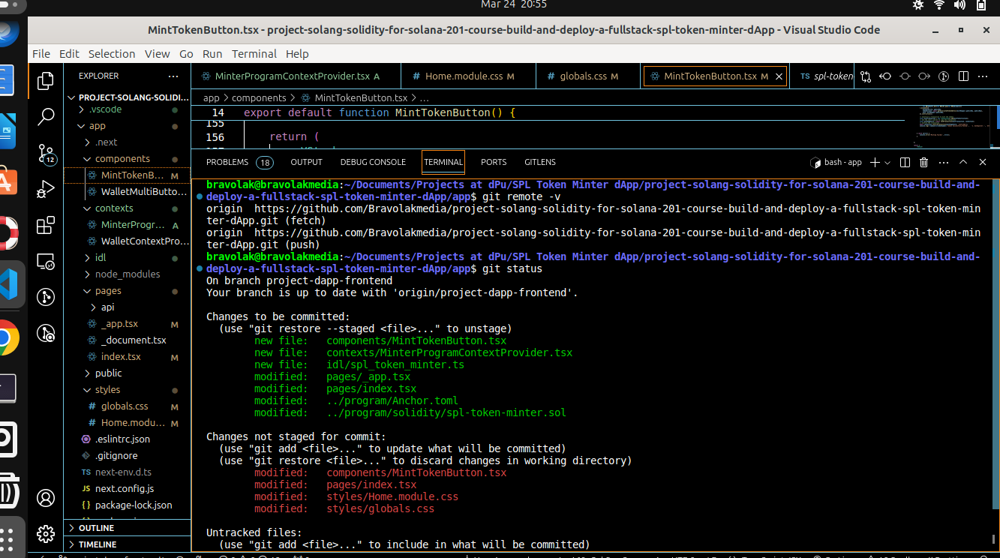

# project-solang-solidity-for-solana-201-course-build-and-deploy-a-fullstack-spl-token-minter-dApp
dPU Capstone Project For Solang Solidity For Solana 201 Course: Build And Deploy A Fullstack SPL Token Minter dApp

This project was done by Olukosi Ismaila Bamidele as a prerequisite for earning certificate on dPu Solang Solidity For Solana 201 Course: Build and Deploy A FullStack SPL Token Minter dApp.

### PROGRAM SECTION:
1. I build, deploy and test the SPL program.
2. I generated my IDL file.
3. I copied the idl code, the TypeScript version for use in my app i.e FrontEnd.
4. I ensured successful implementation of the SPL program without any error.
### APP SECTION:
1. I added my  idl file to the app.
2. I added my MinterProgramContextProvider.ts file
3. I added MintTokenButton.ts file
4. I tried to customize the styling of the dApp in Home.module.css and globals.css

### CHALLENGES
1. I tried to style the background in the Home.module.css and globals.css but the effects are not implemented in the FrontEnd may be because of Next JS used. 
2. I tried to insert a logo for my dApp but could not locate the HTML file for implementing that.
3. I also faced difficulty in making dApp create the associated account for the SPL Token if not found. 4. Different attempts scattered my project beyond recognition before I restored it back to the default state. 
5. I believe I can implement these and overcome my challenges as I learn further in future.

- 